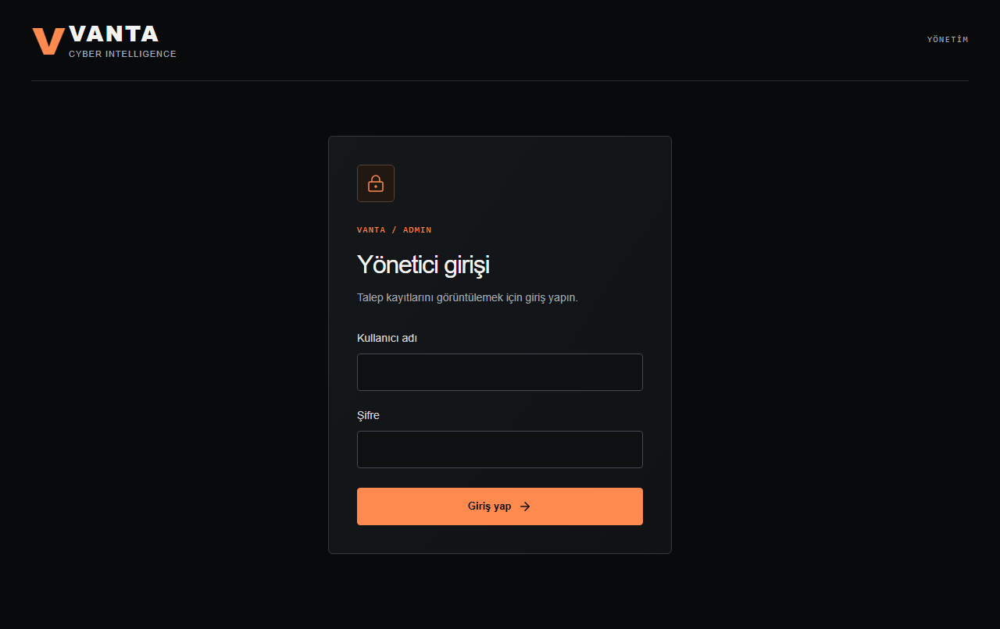
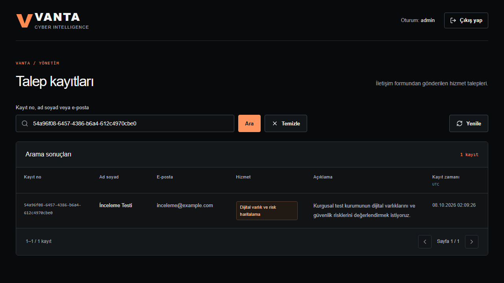
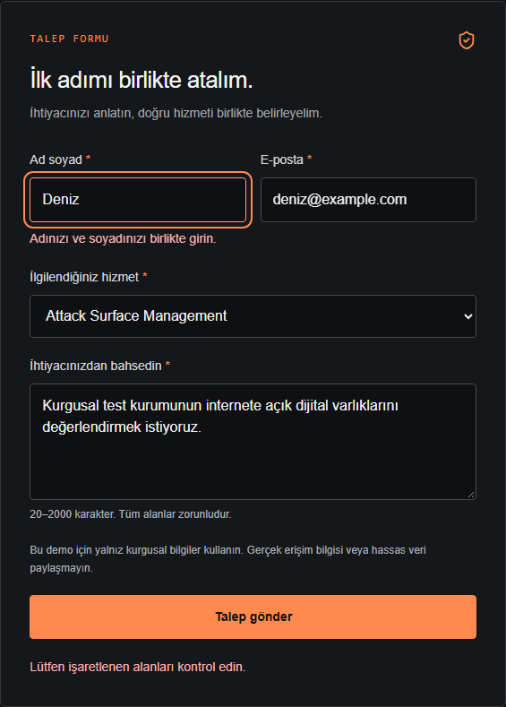
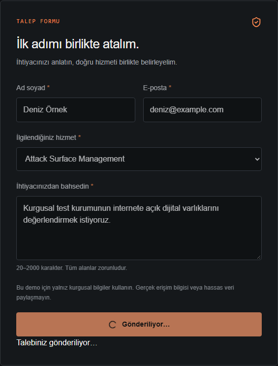
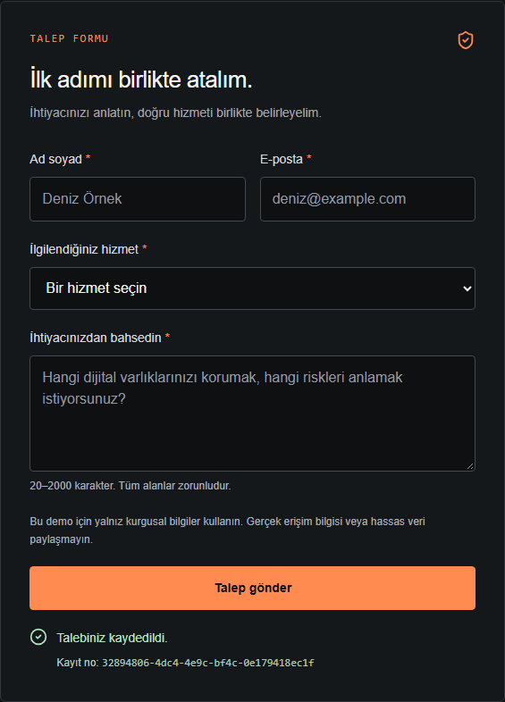
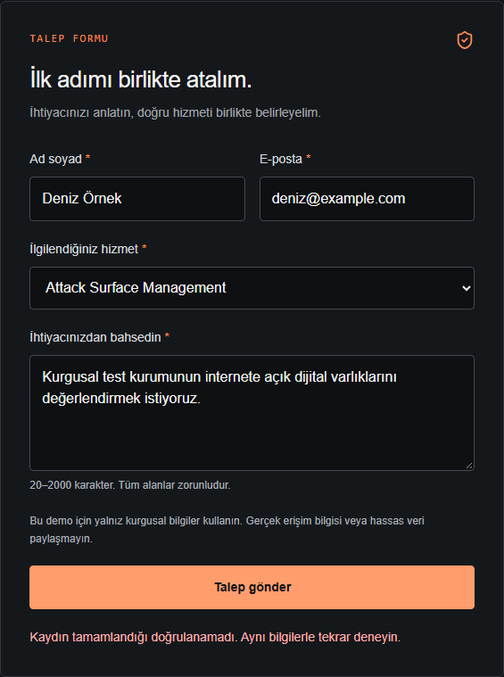

# Canlı inceleme ve doğrulama

[Canlı site](https://vanta-cyber-intelligence.vercel.app) · [Yönetim girişi](https://vanta-cyber-intelligence.vercel.app/admin) · [Kaynak kod](https://github.com/H00wb/vanta-cyber-intelligence)

Bu rapor, ad-soyad doğrulaması eklendikten sonra 8 Ekim 2026 tarihinde yapılan kontrolleri anlatır. Tam canlı tarayıcı koşusu 05:09–05:10, bağımsız veritabanı kontrolü ve test temizliği 05:11 (Europe/Istanbul) saatlerinde tamamlandı. Kontrol edilen uygulama kodu [58f4f8d](https://github.com/H00wb/vanta-cyber-intelligence/commit/58f4f8df50b716e3605529da3a711a5f617349cb) commit'idir. Bu raporu ekleyen teslim commit'i uygulama kodunu değiştirmez; son kimlik kaynak arşivinin yanındaki TESLIM.txt içindedir.

## Değerlendirici için kısa inceleme

1. Siteyi açıp yalnız kurgusal bilgilerle form gönderin. Örneğin Deniz Örnek / deniz@example.com kullanabilirsiniz.
2. Başarı mesajındaki kayıt numarasını kopyalayın.
3. Doğrudan `/admin` adresine gidin. Kullanıcı adı **admin**, şifre **admin123**.
4. Kayıt numarasını arama alanına yapıştırın. İsim, e-posta, hizmet ve açıklamayı gönderdiğiniz bilgilerle karşılaştırın. Kayıt zamanı veritabanından gelir ve UTC olarak gösterilir.
5. Sayfayı yenileyip aynı numarayı tekrar arayın. Aynı satır ve değerler korunmalı. Çıkış yapınca kayıt API'si tekrar giriş ister.

Site ve API Vercel'de çalışır; kayıtlar Supabase PostgreSQL'de saklanır. Panel her aramada/yenilemede sunucu üzerinden veritabanını okur; kaynak içine yazılmış örnek satırları göstermez. Ana sayfada yönetim bağlantısı yoktur.

## Gerçek gönderimin tabloya ulaşması

Aşağıdaki ekran, canlı formdan gönderilen kurgusal talebin UUID ile filtrelenmiş halidir. Form gönderimi 201, yönetim okuması 200 döndü. Aynı satır hem sayfa yenilemesinden sonra hem bağımsız Supabase SQL sorgusunda doğrulandı.

| Alan | Doğrulanan değer |
| --- | --- |
| Kayıt no | 54a96f08-6457-4386-b6a4-612c4970cbe0 |
| İsim | İnceleme Testi |
| E-posta | inceleme@example.com |
| Hizmet | Dijital varlık ve risk haritalama (`risk-mapping`) |
| Açıklama | Kurgusal test kurumunun dijital varlıklarını ve güvenlik risklerini değerlendirmek istiyoruz. |
| Veritabanı zamanı | 8 Ekim 2026 02:09:26 UTC |

**Bu ekran kontrol anının kanıtıdır.** Ad-soyad değişikliğinin kontrolleri bitince yalnız bu turda oluşturulan 10 kurgusal test satırı, kaydedilmiş kimlikleri ve kurgusal alanlarıyla eşleştirilerek temizlendi. Çalışma başlarken veritabanında bulunan iki kayıt korundu; temizlik öncesi ve sonrası her iki satırın özeti aynıydı. Son kontrolde tabloda bu iki kayıt kaldı. Ekrandaki test UUID'si bu nedenle artık bulunmaz; güncel akışı yukarıdaki adımlarla kendi kurgusal kaydınız üzerinden inceleyin. Uygulama gönderilen talepleri kendiliğinden silmez.

Mevcut kişinin adını ve e-postasını kaynak kodda veya kanıt ekranlarında yayımlamadık. Demo giriş bilgileri açıktır; panel bu değerlendirme için salt okunur erişim sağlar.

## Tek ad girildiğinde oluşan hata

Ad soyad alanına yalnız **Deniz** yazıldığında “Adınızı ve soyadınızı birlikte girin.” görünür. Odak ad alanına gider; form POST başlatmaz ve başarı göstermez. Diğer alanları geçerli bırakıp istemci doğrulamasını atlayan aynı isteği API'ye gönderince 422 ve yalnız ad alanı hatası döndü.

Aynı veri anonim Supabase RPC'sine doğrudan gönderildiğinde 400/23514 aldı; `vanta_service_requests_full_name_check` kısıtı kaydı reddetti. Bağımsız SQL okumasında bu kimlik için sıfır satır bulundu. Böylece kural yalnız tarayıcıya bağlı değil.

Birim testinde tek ad, sondaki boşluk ve boş soyad örnekleri reddedildi. Ad-soyad, çok parçalı ad, birden çok boşluk ve NBSP kabul edildi. Gerçek PostgreSQL'de üç ret ve dört kabul örneği alt transaction içinde sınandı; geçerli test satırları geri alındı. Mevcut veriler değiştirilmedi.

## Başarı, hata ve tekrar gönderim sonuçları

| Kontrol | Gözlenen sonuç |
| --- | --- |
| Geçerli canlı form | 201; eşleşen UUID sonrasında başarı mesajı. Dört alan SQL ile eşleşti. |
| Boş/geçersiz form | Tarayıcı isteği engelledi; doğrudan API ile geçersiz alan 422 aldı. |
| Gönderiliyor | Form ve düğme kilitlendi; ikinci gönderim yeni istek başlatmadı. |
| Simüle edilen depolama hatası | 503; bilgiler korundu, başarı mesajı görünmedi. Bu senaryo kontrollü hata taklididir. |
| Ağ kesintisi, HTML yanıtı, yanlış UUID, 15 saniye zaman aşımı | Başarı gösterilmedi; anlaşılır hata/belirsizlik mesajı ve tekrar deneme olanağı korundu. |
| Gerçek kayıttan sonra yanıtın kaybedilmesi | Aynı UUID tekrarında 200/replayed; bağımsız SQL'de tek satır. |
| Aynı UUID ile beş eşzamanlı canlı gönderim | Bir 201 ve dört 200; SQL'de tek satır. |
| Aynı UUID, farklı içerik | 409; ilk satır korundu. |
| Vercel yeniden yayını | Yerel testte daha önce açılan satır, yeni Vercel yayını sonrasında aynı alanlarla SQL'de bulundu. |

## Yönetim ve veritabanı erişimi

| Canlı kontrol | Sonuç |
| --- | --- |
| Oturumsuz veya uydurulmuş çerezle kayıt API'si | 401; satır dönmedi. |
| Geçerli imzalı fakat süresi dolmuş oturum | 401; satır dönmedi. |
| Yanlış parola | 401; oturum açılmadı. |
| Yabancı veya eksik Origin ile giriş | 403. Yabancı Origin ile çıkış da 403 aldı. |
| Doğru giriş ve yenileme | 200; HttpOnly, SameSite=Strict, Secure ve bir saatlik çerez doğrulandı. |
| Yetkili kayıt okuma | 200; private/no-store. Mevcut kayıt kimliğiyle bulunabildi. |
| Geçersiz sayfa numarası | 422. |
| Çıkış | 204; çerez temizlendi. Tarayıcıdan sonraki kayıt okuması 401 aldı. |
| Publishable key ile doğrudan tablo okuma/yazma | 401; anonim tablo yetkisi kapalı. |
| Yanlış token ile yönetim RPC'si | 401; satır dönmedi. |
| Giriş sınırı için gerçek DB'ye 11 paralel çağrı | Aynı kurgusal limit anahtarında 10 izin, 1 ret. Bu, API'nin 429 davranışını sınayan birim testinden ayrı PostgreSQL kontrolüdür. |
| Aramada `%`, `_` ve ters bölü | Joker olarak genişlemek yerine düz karakter olarak arandı; sonuçlar mevcut alanlarla karşılaştırıldı. |

Çıkış tarayıcıdaki çerezi temizler. Oturum stateless olduğu için önceden kopyalanmış bir çerez, bir saatlik süresi dolana kadar geçerli kalır. Panel salt okunurdur; düzenleme/silme arayüzü yoktur. Okuma token'ı ve parola özeti tarayıcıya verilmez.

## Test kapsamı ve ekran uyumu

- **76/76 Node testi:** 32 form/API, 10 Supabase kayıt bağlantısı, 6 SSR, 18 yönetim kimlik/HTTP ve 10 yönetim deposu.
- **22/22 yerel Chromium, 22/22 canlı Chromium:** 16 sayfa/form ve 6 yönetim senaryosu.
- **Lint, TypeScript ve üretim derlemesi:** başarılı.
- **320, 390, 768 ve 1440 px:** sayfa/form kullanılabilir, sayfa yatay taşmadı. Yönetimde 390 px tablonun kaydırması kendi bölgesinde kaldı.
- **Klavye, %200 metin ve axe WCAG A/AA:** ilgili senaryolar geçti; landing, giriş ve kurgusal satırlı panel taramalarında ihlal çıkmadı. Bu sonuç manuel ekran okuyucu veya bütün erişilebilirlik koşullarının yerine geçmez.

Her testin neyi sınadığı [TEST_SONUCLARI.md](TEST_SONUCLARI.md), komutlar ve manuel adımlar [TEST_REHBERI.txt](TEST_REHBERI.txt) içindedir. Node testlerinin geçici SQLite/taklit HTTP/SDK kullanımı gerçek PostgreSQL kanıtından ayrı belirtilmiştir. Ayrı canlı HTTP kontrolü ve SQL okuması yukarıdaki kalıcılık ve izin sonuçlarını doğruladı.

[Masaüstü ekran görüntüsü](evidence/vercel-desktop.png) · [Mobil ekran görüntüsü](evidence/vercel-mobile.png)

Eski veritabanı temizlenmeden önce üretilen JSON/TAP kanıt dosyaları teslimden kaldırıldı. Bu rapor güncel kontrolleri ve test temizliğini açıklar; önceki satırların hâlâ var olduğunu ileri sürmez.
